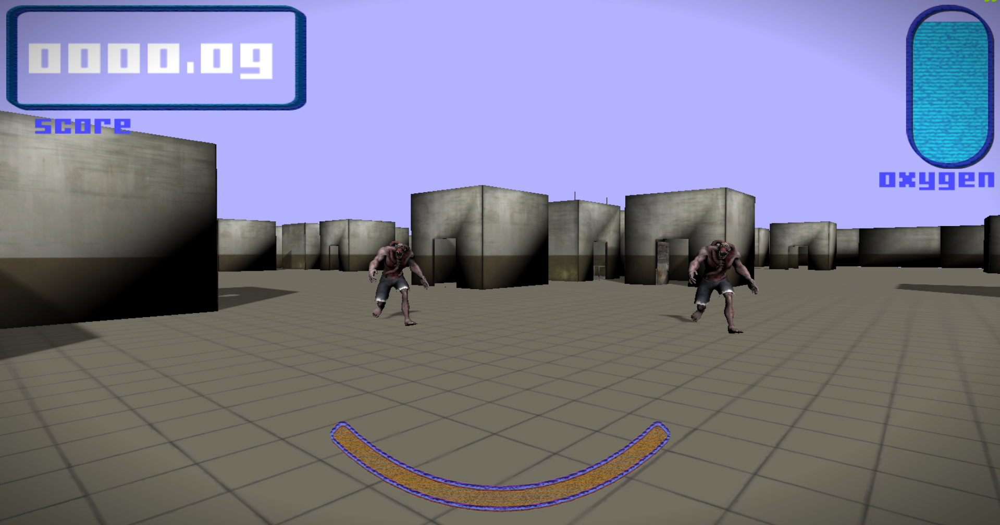
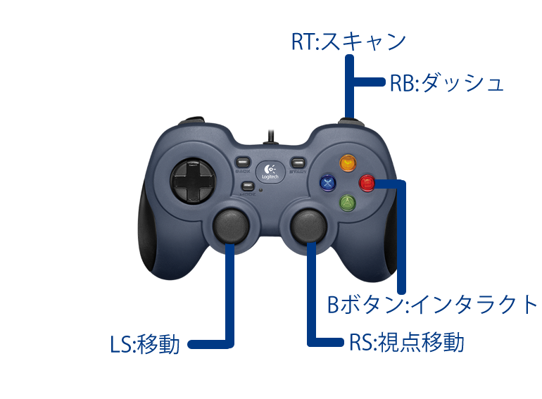

# SALVAGE
> ### 河原電子ビジネス　ゲームクリエイター科
> ### 氏名：武田　悠世 （たけだ　はるせ）

# 目次
- [SALVAGE](#salvage)
- [目次](#目次)
  - [作品概要](#作品概要)
- [1.作成したソースコード](#1作成したソースコード)
- [2.作成したエンジンコード](#2作成したエンジンコード)
- [3.作成したシェーダー](#3作成したシェーダー)
- [4.ゲーム説明](#4ゲーム説明)
- [5.操作説明](#5操作説明)
- [6.技術紹介](#6技術紹介)
  - [6-1.ステートマシン](#6-1ステートマシン)
  - [6-2.集団制御(メタＡＩ)](#6-2集団制御メタａｉ)
  - [6-3.川瀬式Bloomフィルターの実装](#6-3川瀬式bloomフィルターの実装)
  - [6-4.デバッグ機能](#6-4デバッグ機能)

 
  

## 作品概要
> <dl>
> <dt>タイトル</dt>
> <dd>SALVAGE</dd>
> <dt>制作期間</dt>
> <dd>2024年8月から現在まで</dd>
> <dt>ゲームジャンル</dt>
> <dd>ホラーゲーム</dd>
> <dt>プレイ人数</dt>
> <dd>一人</dd>
> <dt>使用言語</dt>
> <dd>C++</dd>
> <dd>HLSL</dd>
> <dt>使用ツール</dt>
> <dd>Visual Studio 2022</dd>
> <dd>Visual Studio Code</dd>
> <dd>Adobe Photoshop 2025</dd>
> <dd>3ds Max 2024</dd>
> <dd>Effekseer</dd>
> <dd>GitHub</dd>
> <dd>Fork</dd>
> <dd>Trello</dd>
> <dt>開発環境</dt>
> <dd>学校内製の簡易エンジン</dd>
> <dd>Windows11</dd>
> <dt>GitHubのURL</dt>
> <dd>https://github.com/harusame777/haruGame</dd>
> </dl>

 

# 1.作成したソースコード
>- Accessories.cpp
>- Accessories.h
>- BackGroundCeiling.cpp
>- BackGroundCeiling.h
>- BackGroundFloor.cpp
>- BackGroundFloor.h
>- BackGroundWalls.cpp
>- BackGroundWalls.h
>- BootObjectBase.cpp
>- BootObjectBase.h
>- Crystal.cpp
>- Crystal.h
>- CrystalDataHolder.h
>- CrystalGetCommandSprite.cpp
>- CrystalGetCommandSprite.h
>- DebugEnemyTrackingState.cpp
>- DebugEnemyTrackingState.h
>- Elevator.cpp
>- Elevator.h
>- Enemy_Warrior.cpp
>- Enemy_Warrior.h
>- EnemyAIBase.cpp
>- EnemyAIBase.h
>- EnemyAIConBase.cpp
>- EnemyAIConBase.h
>- EnemyAIConColPlayer.cpp
>- EnemyAIConColPlayer.h
>- EnemyAIConSearch.cpp
>- EnemyAIConSearch.h
>- EnemyAIConWaitTime.cpp
>- EnemyAIConWaitTime.h
>- EnemyAIConWallSearch.cpp
>- EnemyAIConWallSearch.h
>- EnemyAIMetaBase.cpp
>- EnemyAIMetaBase.h
>- EnemyAIMetaWarrior.cpp
>- EnemyAIMetaWarrior.h
>- EnemyAIMove.cpp
>- EnemyAIMove.h
>- EnemyAIMoveAstar.cpp
>- EnemyAIMoveAstar.h
>- EnemyBase.cpp
>- EnemyBase.h
>- EnemySM_Warrior.cpp
>- EnemySM_Warrior.h
>- EnemySMBase.cpp
>- EnemySMBase.h
>- EnemyWarriorTrackingState.h
>- Game.cpp
>- Game.h
>- GameCamera.cpp
>- GameCamera.h
>- Gameover.cpp
>- Gameover.h
>- GameSound.cpp
>- GameSound.h
>- Load.cpp
>- Load.h
>- Locker.cpp
>- Locker.h
>- ManagerCrystal.cpp
>- ManagerCrystal.h
>- ObjectBase.cpp
>- ObjectBase.h
>- PatrolRuteDataHolder.h
>- Player.cpp
>- Player.h
>- PlayerOxygenUi.cpp
>- PlayerOxygenUi.h
>- PlayerScanCrystalUi.cpp
>- PlayerScanCrystalUi.h
>- PlayerScoreUi.cpp
>- PlayerScoreUi.h
>- PlayerStaminaUi.cpp
>- PlayerStaminaUi.h
>- PlayerUIBase.h
>- Result.cpp 
>- Result.h
>- Title.cpp
>- Title.h
>- WarriorAIMetaFootSteps.cpp
>- WarriorAIMetaFootSteps.h
>- WarriorAIMetapPatrol.cpp
>- WarriorAIMetapPatrol.h
>- WarriorAIMetaRetreat.cpp
>- WarriorAIMetaRetreat.h
>- WarriorAIMetaStop.cpp
>- WarriorAIMetaStop.h
>- WarriorAIMetaTracking.cpp
>- WarriorAIMetaTracking.h
>- WarriorDataHolder.h
>- Window.cpp
>- Window.h

 

# 2.作成したエンジンコード 
>- DirectionalLight.cpp
>- DirectionalLight.h
>- FontRender.cpp
>- FontRender.h
>- IRenderer.h
>- LevelRender.cpp 
>- LevelRender.h
>- LuminnceRender.cpp
>- LuminnceRender.h
>- ModelRender.cpp
>- ModelRender.h
>- PointLight.cpp
>- PointLight.h
>- RenderingEngine.cpp
>- RenderingEngine.h
>- SceneLight.cpp
>- SceneLight.h
>- ShadowMapRender.cpp
>- ShadowMapRender.h
>- SpotLight.cpp
>- SpotLight.h
>- SpriteRender.cpp
>- SpriteRender.h

 

# 3.作成したシェーダー
>- haruharuCircularGaugeSprite.fx
>- haruharuCrystalModel.fx
>- haruharuDeaphShadowReceiverModel.fx
>- haruharuDrawDeaphShadowMap.fx
>- haruharuDrawShadowMap.fx
>- haruharuLoadSpriteShader.fx
>- haruharuModel.fx
>- haruharuOxygenGaugeSpriteShader.fx
>- haruharuPostEffect.fx
>- haruharuRenderToGBufferFor3DModel.fx
>- haruharuShadowReceiverModel.fx
>- haruharuSprite.fx
>- haruharuStaminaBarSpriteShader.fx
>- haruharuWindowSpriteShader.fx
>- haruharuWipeSprite.fx
>- haruharuWipeSpriteMoveVer.fx

 

# 4.ゲーム説明
> ### このゲームは廃研究所に侵入した主人公が研究所内部にある鉱石を</dd>
> ### 残り酸素が続く限り採取して、内部にいるモンスターに襲われないように</dd>
> ### 研究所から脱出するホラー採取ゲームです</dd>
> ### 酸素ゲージがなくなる前に、できるだけ多くの鉱石を採取するのが目的の</dd>
> ### ゲームです。
>
> メインゲーム画面
> 
> 

 

# 5.操作説明
> 

 

# 6.技術紹介

 

## 6-1.ステートマシン
>実装理由:プログラムの順序を分かりやすく視覚化しておくことによって、
>プログラムの制御や追加がやりやすくなるため。
>
>例：モンスターのステートマシン
> 

 

## 6-2.集団制御(メタＡＩ)
>実装理由:モンスター3体の集団制御のため
>
>実際のメタAIの形式
> 

 

## 6-3.川瀬式Bloomフィルターの実装
>実装理由:暗がりでの光をよりリアルに見せるため
>
><dl>
><dt>実装方式</dt>
><dt>1.輝度抽出用のレンダリングターゲットを作成する。</dt>
><dd>本書や、サンプルプログラムでは、同じくレンダリングエンジンのプログラムファイルに記載されているが</dd>
><dd>今回はプログラム量の多さから、分かりにくくなってしまうためプログラムをクラスにして別に実装した。
><dd>説明上の分かりやすさのため輝度抽出クラスと呼びます。</dd>
><dd>この輝度抽出クラスをレンダリングエンジン側でメンバ変数として宣言、レンダリングエンジンの
><dd>初期化の際共に初期化し、その初期化のタイミングでレンダリングターゲットが作成される。
><dd>この初期化の際には、ほかにも</dd>
><dd>・輝度抽出用のスプライトの初期化</dd>
><dd>・ガウシアンブラークラスの初期化、ぼかすテクスチャのアドレスの設定</dd>
><dd>・生成したボケ画像を合成するスプライトの初期化
><dd>などが行われている。</dd>
></dl>
>以下輝度抽出_合成描画用のシェーダーのプログラム
>

>
> cbuffer cb : register(b0)
> {
>     float4x4 mvp;       // MVP行列
>     float4 mulColor;    // 乗算カラー
> };
> 
> struct VSInput
> {
>     float4 pos : POSITION;
>     float2 uv  : TEXCOORD0;
> };
> 
> struct PSInput
> {
>     float4 pos : SV_POSITION;
>     float2 uv  : TEXCOORD0;
> };
> 
> /*!
>  * @brief 頂点シェーダー
>  */
> PSInput VSMain(VSInput In)
> {
>     PSInput psIn;
>     psIn.pos = mul(mvp, In.pos);
>     psIn.uv = In.uv;
>     return psIn;
> }
> 
> Texture2D<float4> mainRenderTargetTexture : register(t0); // メインレンダリングターゲットのテクスチャ
> sampler Sampler : register(s0);
> 
> /////////////////////////////////////////////////////////
> // 輝度抽出用
> /////////////////////////////////////////////////////////
> /*!
>  * @brief 輝度抽出用のピクセルシェーダー
>  */
> float4 PSLuminance(PSInput In) : SV_Target0
> {
>     // 輝度を抽出するピクセルシェーダーを実装
>     float4 color = mainRenderTargetTexture.Sample(Sampler, In.uv);
>     
>     // サンプリングされたカラーの明るさを計算
>     float t = dot(color.xyz, float3(0.2125f, 0.7154f, 0.0721f));
>     
>     // clip関数は引数の値がマイナスになると以降の処理をスキップする
>     // なので、マイナスになるとピクセルカラーは出力されない
>     // 今回の実装はカラーの明るさが1以下ならピクセルキルする
>     clip(t - 0.9f);
>     
>     return color;
> }
> 
> // ボケ画にアクセスする為の変数
> Texture2D<float4> g_bokeTexture_0 : register(t0);
> Texture2D<float4> g_bokeTexture_1 : register(t1);
> Texture2D<float4> g_bokeTexture_2 : register(t2);
> Texture2D<float4> g_bokeTexture_3 : register(t3);
> 
> // ボケ画像合成用のピクセルシェーダー
> float4 PSBloomFinal(PSInput In) : SV_Target0
> {
>     // ボケ画像を合成
>     float4 combineColor = g_bokeTexture_0.Sample(Sampler, In.uv);
>     combineColor += g_bokeTexture_1.Sample(Sampler, In.uv);
>     combineColor += g_bokeTexture_2.Sample(Sampler, In.uv);
>     combineColor += g_bokeTexture_3.Sample(Sampler, In.uv);
>     combineColor /= 4.0f;
>     combineColor.a = 1.0f;
>     return combineColor;
> }
> 
>

><dl>
><dt>2.輝度抽出をするタイミングでレンダリングターゲットを作成したものに変更する。</dt>
><dd>レンダリングターゲットをモデルの描画やライトの処理をしたレンダリングターゲットから変更する。
><dd>輝度抽出クラスの関数に変更からその後の処理までがプログラムされているため</dd>
><dd>関数から抜ける頃には輝度抽出の処理は終わっている。</dd>
><dt>3.ガウシアンブラーの実行</dt>
><dd>通常のBloomとは違い複数回ガウシアンブラーを実行します。こうすることで、光のあふれテクスチャを</dd>
><dd>生成することができます。</dd>
><dt>4.ボケ画像を合成しメインレンダリングターゲットに加算する</dt>
><dd>シェーダー側でボケ画像を合成し、メインレンダリングターゲットにレンダリングターゲットを変更</dd>
><dd>合成します。</dd>
><dd>この合成スプライトは輝度抽出クラスで宣言、初期化されているため、レンダリングエンジンのプログラム</dd>
><dd>から、輝度抽出クラスのメンバ変数を使ってクラスにあるドローコール関数を実行します。
><dd>これにより、川瀬式Bloomフィルターを使用した輝度抽出から合成描画までが完了します。</dd>
></dl>

 

## 6-4.デバッグ機能
>実装理由:デバッグのため
>
>今回の開発では、ifdef _DEBUGを使い、Debugの起動方式で自動的に
>デバックのプログラムが実行されるようにした。
><dl>
><dt>追加したデバッグ機能は</dt>
><dd>鉱石が採取可能かどうか画面に表示</dd>
><dd>鉱石採取時のコマンドステートを画面に表示</dd>
><dd>現在のエネミーのステートを色分けで画面に表示</dd>
><dd>カメラを一人称から三人称に切り替えるボタンを有効化(LB)</dd>
><dd>残り酸素量を時間で画面に表示</dd>
></dl>

 