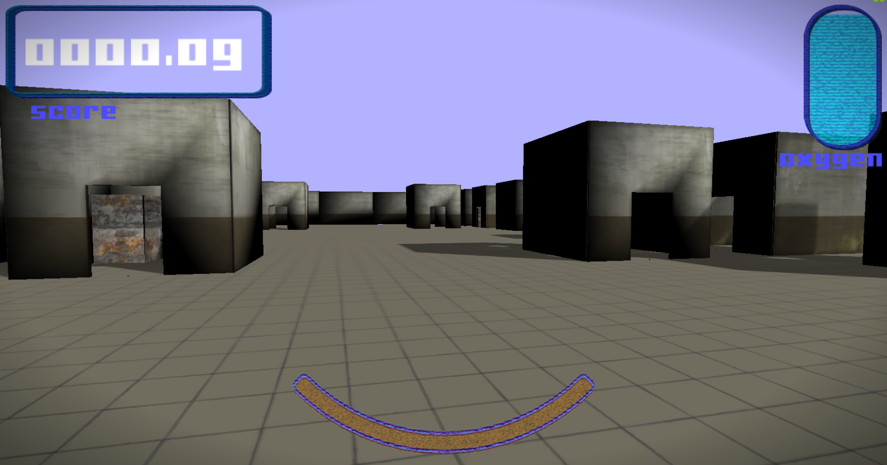
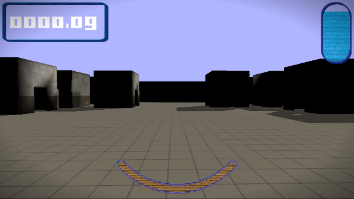
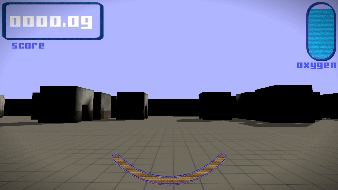
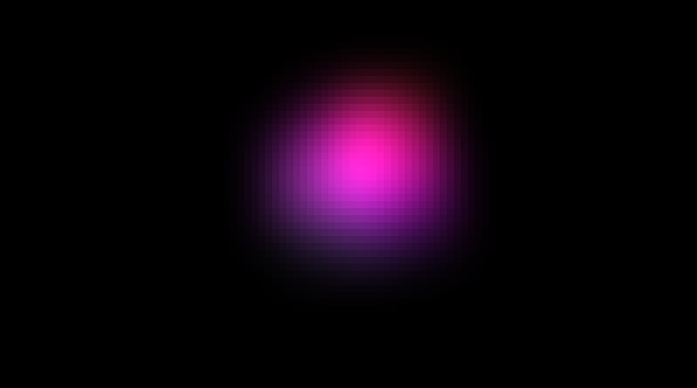
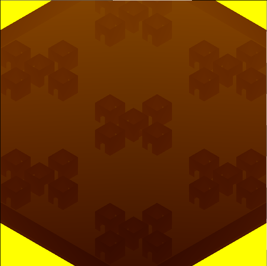
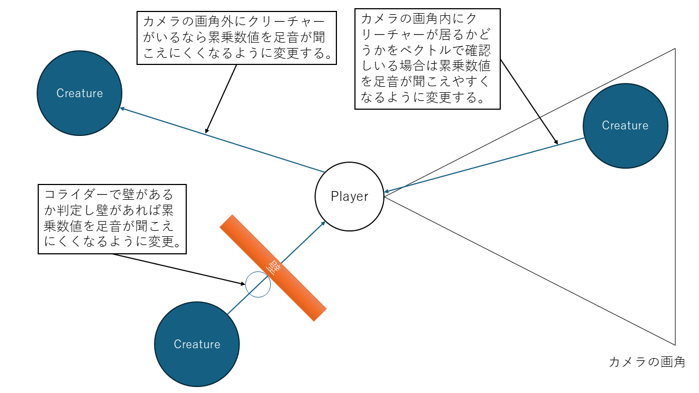

# SALVAGE
> ### 河原電子ビジネス ゲームクリエイター科
> ### 氏名：武田 悠世 （たけだ はるせ）

# 目次
- [SALVAGE](#salvage)
- [目次](#目次)
  - [作品概要](#作品概要)
- [1.作成したソースコード](#1作成したソースコード)
- [2.作成したエンジンコード](#2作成したエンジンコード)
- [3.作成したシェーダー](#3作成したシェーダー)
- [4.操作説明](#4操作説明)
- [5.ゲーム説明](#5ゲーム説明)
- [5-1.プレイヤーについて](#5-1プレイヤーについて)
- [5-2.スタミナUIについて](#5-2スタミナuiについて)
- [5-3.酸素UIについて](#5-3酸素uiについて)
- [5-4.スコアUIについて](#5-4スコアuiについて)
- [5-5.クリーチャーについて](#5-5クリーチャーについて)
- [5-6.クリスタルについて](#5-6クリスタルについて)
- [5-7.ロッカーについて](#5-7ロッカーについて)
- [5-8.ウィンドウインフォメーションについて](#5-8ウィンドウインフォメーションについて)
- [6.技術紹介](#6技術紹介)
- [7-1.ステートマシン](#7-1ステートマシン)
- [6-2.集団制御(メタＡＩ)](#6-2集団制御メタａｉ)
- [6-3.川瀬式Bloomフィルターの実装](#6-3川瀬式bloomフィルターの実装)
- [6-5.VSMの実装](#6-5vsmの実装)
- [6-4.立体音](#6-4立体音)
- [6-5.デバッグ機能](#6-5デバッグ機能)
- [7.今後の展望](#7今後の展望)

 
  

## 作品概要
> <dl>
> <dt>タイトル</dt>
> <dd>SALVAGE</dd>
> <dt>制作期間</dt>
> <dd>2024年8月から現在まで</dd>
> <dt>ゲームジャンル</dt>
> <dd>ホラーゲーム</dd>
> <dt>プレイ人数</dt>
> <dd>一人</dd>
> <dt>使用言語</dt>
> <dd>C++</dd>
> <dd>HLSL</dd>
> <dt>使用ツール</dt>
> <dd>Visual Studio 2022</dd>
> <dd>Visual Studio Code</dd>
> <dd>Adobe Photoshop 2025</dd>
> <dd>3ds Max 2024</dd>
> <dd>Effekseer</dd>
> <dd>GitHub</dd>
> <dd>Fork</dd>
> <dd>Trello</dd>
> <dt>開発環境</dt>
> <dd>学校内製の簡易エンジン</dd>
> <dd>Windows11</dd>
> <dt>GitHubのURL</dt>
> <a href="https://github.com/harusame777/haruGame"><dd>https://github.com/harusame777/haruGame</dd></a>
> <dd>プレイ動画のURL</dd>
> <a href="https://youtu.be/jW00RJZBNB4"><dd>https://youtu.be/jW00RJZBNB4</dd></a>
> </dl>

 

# 1.作成したソースコード
>- Accessories.cpp
>- Accessories.h
>- BackGroundCeiling.cpp
>- BackGroundCeiling.h
>- BackGroundFloor.cpp
>- BackGroundFloor.h
>- BackGroundWalls.cpp
>- BackGroundWalls.h
>- BootObjectBase.cpp
>- BootObjectBase.h
>- Crystal.cpp
>- Crystal.h
>- CrystalDataHolder.h
>- CrystalGetCommandSprite.cpp
>- CrystalGetCommandSprite.h
>- DebugEnemyTrackingState.cpp
>- DebugEnemyTrackingState.h
>- Elevator.cpp
>- Elevator.h
>- Enemy_Warrior.cpp
>- Enemy_Warrior.h
>- EnemyAIBase.cpp
>- EnemyAIBase.h
>- EnemyAIConBase.cpp
>- EnemyAIConBase.h
>- EnemyAIConColPlayer.cpp
>- EnemyAIConColPlayer.h
>- EnemyAIConSearch.cpp
>- EnemyAIConSearch.h
>- EnemyAIConWaitTime.cpp
>- EnemyAIConWaitTime.h
>- EnemyAIConWallSearch.cpp
>- EnemyAIConWallSearch.h
>- EnemyAIMetaBase.cpp
>- EnemyAIMetaBase.h
>- EnemyAIMetaWarrior.cpp
>- EnemyAIMetaWarrior.h
>- EnemyAIMove.cpp
>- EnemyAIMove.h
>- EnemyAIMoveAstar.cpp
>- EnemyAIMoveAstar.h
>- EnemyBase.cpp
>- EnemyBase.h
>- EnemySM_Warrior.cpp
>- EnemySM_Warrior.h
>- EnemySMBase.cpp
>- EnemySMBase.h
>- EnemyWarriorTrackingState.h
>- Game.cpp
>- Game.h
>- GameCamera.cpp
>- GameCamera.h
>- GameInformation.cpp
>- GameInformation.h
>- Gameover.cpp
>- Gameover.h
>- GameSound.cpp
>- GameSound.h
>- GameWindow.cpp
>- GameWindow.h
>- Load.cpp
>- Load.h
>- Locker.cpp
>- Locker.h
>- LockerDataHolder.h
>- ManagerCrystal.cpp
>- ManagerCrystal.h
>- ManagerLocker.cpp
>- ManagerLocker.h
>- ObjectBase.cpp
>- ObjectBase.h
>- PatrolRuteDataHolder.h
>- Player.cpp
>- Player.h
>- PlayerInteractableUi.cpp
>- PlayerInteractableUi.h
>- PlayerOxygenUi.cpp
>- PlayerOxygenUi.h
>- PlayerPointerUi.cpp
>- PlayerPointerUi.h 
>- PlayerScanCrystalUi.cpp
>- PlayerScanCrystalUi.h
>- PlayerScoreUi.cpp
>- PlayerScoreUi.h
>- PlayerStaminaUi.cpp
>- PlayerStaminaUi.h
>- PlayerUIBase.h
>- Result.cpp 
>- Result.h
>- Title.cpp
>- Title.h
>- WarriorAIMetaChaseBGM.cpp
>- WarriorAIMetaChaseBGM.h
>- WarriorAIMetaFootSteps.cpp
>- WarriorAIMetaFootSteps.h
>- WarriorAIMetapPatrol.cpp
>- WarriorAIMetapPatrol.h
>- WarriorAIMetaRetreat.cpp
>- WarriorAIMetaRetreat.h
>- WarriorAIMetaIdle.cpp
>- WarriorAIMetaIdle.h
>- WarriorAIMetaStop.cpp
>- WarriorAIMetaStop.h
>- WarriorAIMetaTracking.cpp
>- WarriorAIMetaTracking.h
>- WarriorDataHolder.h
>- Window.cpp
>- Window.h

 

# 2.作成したエンジンコード 
>- DirectionalLight.cpp
>- DirectionalLight.h
>- FontRender.cpp
>- FontRender.h
>- IRenderer.h
>- LevelRender.cpp 
>- LevelRender.h
>- LuminnceRender.cpp
>- LuminnceRender.h
>- ModelRender.cpp
>- ModelRender.h
>- PointLight.cpp
>- PointLight.h
>- RenderingEngine.cpp
>- RenderingEngine.h
>- SceneLight.cpp
>- SceneLight.h
>- ShadowMapRender.cpp
>- ShadowMapRender.h
>- SpotLight.cpp
>- SpotLight.h
>- SpriteRender.cpp
>- SpriteRender.h

 

# 3.作成したシェーダー
>- haruharuCircularGaugeSprite.fx
>- haruharuCrystalModel.fx
>- haruharuDeaphShadowReceiverModel.fx
>- haruharuDrawDeaphShadowMap.fx
>- haruharuDrawShadowMap.fx
>- haruharuDrawVSMShadowMap.fx
>- haruharuLoadSpriteShader.fx
>- haruharuModel.fx
>- haruharuOxygenGaugeSpriteShader.fx
>- haruharuPostEffect.fx
>- haruharuRenderToGBufferFor3DModel.fx
>- haruharuShadowReceiverModel.fx
>- haruharuSprite.fx
>- harmuharuStaminaBarSpriteShader.fx
>- haruharuWindowSpriteShader.fx
>- haruharuWipeSprite.fx
>- haruharuWipeSpriteMoveVer.fx

 

# 4.操作説明
>
>  

>

 

# 5.ゲーム説明
> ## このゲームは廃研究所に侵入した主人公が研究所内部にある鉱石を残り酸素が続く限り採取して、内部にいるモンスターに襲われないように研究所から脱出するホラー採取ゲームです。酸素ゲージがなくなる前に、できるだけ多くの鉱石を採取するのが目的のゲームです。
>
> - # メインゲーム画面
> 
>  

>
> 
>  

> 

 

# 5-1.プレイヤーについて
>
> - # 実装方式
> - ## FPS視点について
> ## カメラをマップのちょうどプレイヤーの視点の高さに来るように配置し、そのカメラをキャラクターコントローラーに追従させる形で実装しました。
> - ## ダッシュについて
> ## キャラクタークラス内でスタミナUIのインスタンスを取得し、そのインスタンスにスタミナ変数の値を渡すことによって外部出力を行っています。</dd>
> - # 工夫した点
> - ## なぜFPSか
> ## FPSにすることにより、モンスターに追われる際や、モンスターから隠れている状況でより緊張感が生まれ、よりゲームに没入し楽しめるのではないかと思ったからです。後述する方法で音を三次元的に表現しているため、FPS視点もあいまって、かなりリアルに近い緊張感を感じる事ができます。
> - ## 線形保管の応用
> ## 線形保管を応用することで、カメラの動きを滑らかにしました。具体的に処理を説明すると、今回のスティック入力値から、前回のフレームのスティック入力値まで0.8fほどの強さで線形保管した数値を使ってカメラを回転させます。この時に3.0fを掛け算することでカメラのスピードを早くしています。
> ### 以下は比較要の動画です
> ### 線形保管なし
>
>  

>
> ### 線形保管あり
>
>  

>

 

# 5-2.スタミナUIについて
>
> - # 実装方式
> - ## UIの動きについて
> ## UIの枠とゲージを別々に描画し、ゲージの方を円形ワイプを応用して増減を表現しました。そして、プレイヤー側のスタミナ変数の割合でゲージの割合を制御することでスタミナの数値によってスタミナゲージが変化するように設計しました。
> ### 以下はUIの動きの映像になります。
>
>  

>
>
>  

> 
> - # 工夫した点
> - ## プログラムの設計
> ## 外部から変数を設定できるようにし、再利用性を高め、変数の変更等があったりした時に対応できるようにしました。
> - ## 演出面
> ## スタミナ低下時にスタミナを点滅させるようにし、またスタミナがなくなった時はスタミナを赤く点滅させるようにして、ユーザーから見てスタミナの状態が分かりやすいようにしました。

 

# 5-3.酸素UIについて
>
> - # 実装方式
> - ## UIの動きについて
> ## ゲージは通常のワイプを使用し増減を表現しました。そして、ゲーム側のタイマー変数の割合でゲージの割合を制御する事でタイマーの数値によってゲージが変化するように設計しました。
> ### 以下はUIの動きの映像になります。
>
>  

>
>
>  

> 
> - # 工夫した点
> - ## プログラムの設計
> ## こちらもスタミナゲージと同じく、外部から変数を設定できるようにし、再利用性を高め、変数の変更等の理由があったりした時に対応できるようにしました。
> - ## 演出面
> ## タイマーが半分以下になった際にゲージを黄色に変更するようにし、タイマーが1分以下になった際にゲージを赤色にし、点滅させ、ユーザーに緊張感と焦りを与えよりスリルを味わえるようにしました。

 

# 5-4.スコアUIについて
>
> - # 実装方式
> - ## UIの動きについて
> ## スコアは学校側のエンジンの元々の機能である文字描画で表現しました。そして、クリスタルのクラス内の関数から、スコアUI内の関数に増加分の数値を引数として設定、実行することでスコアの増減を行えるように設計しました。
> ### 以下はUIの動きの映像になります。
>
>  

>
>
>  

>
> - # 工夫した点
> - ## 増減の表現方式
> ## 増減の表現方式として、スコアを加算する際に、スコア加算分を計算したスコアに向けて、現在表示中のUIの変数を少しずつ増やす方式を取りました。こうする事で、デジタル感が表現できて、世界観にとてもマッチしているので、作ってよかったと思いました。

 

# 5-5.クリーチャーについて
>
> - # 実装方式
> - ## 仕様
> ## 数は全部で3体
> ## 特殊能力等の設定などはない
> ## 研究所をうろついている実験動物みたいなイメージ
> - ## 行動について
> ## 行動は全部で3パターンあり、それぞれ、巡回、追跡、待機、となっている。
> ## 巡回状態では、エネミー生成時に設定される、いくつかのステージ内の座標を目的地とし、そこに向かって学校エンジン製のナビメッシュを使用したパス移動を行う、これをプレイヤーが見つかるか、目的地に到達する、後述するメタAIから指示が出るまで繰り返す。
> ## 追跡状態では、プレイヤーの座標を取得し、その座標を目的地としてナビメッシュを使用したパス移動、またはキャラクターコントローラーを使用した移動を行う、プレイヤーと自身の間に、壁があるかないかで、パス移動をするかキャラクターコントローラー移動をするかを切り替え、自然な移動、追跡をすることができる。こちらは、プレイヤーに自身が接触するか、プレイヤーを見失うまで繰り返す。
> ## 待機状態では、３秒待ってから、次の巡回位置の決定をし、巡回へと行動を切り替える処理を行う。
> ### 以下はエネミーの画像です 
>
>  

>

 

# 5-6.クリスタルについて
>
> - # 実装方式
> - ## 仕様
> ## 同時スポーンは3個まで
> ## 発生場所はランダム
> ## 一度採取した場合は5秒後に別の場所にリスポーンする
> - ## 採取方法
> ## 視点を合わせ、Bボタンを押すと、採取コマンドが出現する、採取コマンドの真ん中にはA、B、X、Yのうちどれかが表示されており、対応しているボタンを時間内に押すと、次のコマンドが表示される、これを5回繰り返すと採取成功となり、スコアが加算される。
> ### 以下はクリスタルと採取スプライトの画像です
>
>  

>
> - # 工夫した点
> - ## 設置プログラム
> ## クリスタル全体を管理するプログラムを作成し、マップの設置場所をレベルから取得し初期設置を行ったり、常に取得されたかどうかを監視し、取得されたら再設置タイマーを設定、再設置まで行うように設計しました。
> - ## 採取コマンドのスプライト
> ## 採取コマンドのスプライトは動きをこだわりました、ツルハシの回転をイージングで行い動きをつけました。残りコマンド時間が分かりやすいように残り時間で、コマンド周辺の円が円形ワイプで減少するように作りました。

 

# 5-7.ロッカーについて
>
> - # 実装方式
> - ## 仕様
> ## スポーン数は25個
> ## 設置場所はランダム
> - ## 機能説明
> ## 視点を合わせBボタンを押すと、ロッカーの中に隠れる事ができる、ロッカーに隠れると、クリーチャーから発見されなくなる。追跡中の場合はロッカーに隠れた時点で、クリーチャーの追跡が中断される。
> ### 以下はロッカーを実際に使用している際の動画です
>
>  

>
> - # 工夫した点
> - ## 設置プログラム
> ## クリスタルと同じく、ロッカー全体を管理するプログラムを作成し、こちらも同じくレベルから位置を取得し初期設定を行いました。また、どのロッカーが使用中かを判断し、ロッカーが使用中なら処理を行わないプログラムを作成できるようにし、バグを防止しています。

# 5-8.ウィンドウインフォメーションについて
>
> - # 実装方式
> - ## UIの動きについて
> ## スプライトは、一番下に、文字を表示させる場所である、ウィンドウベースを作成し、その上に、ウィンドウの枠である、ウィンドウバーを描画する構成にしています。そして、ウィンドウバーを上下に動かす際に、ウィンドウベースを上下からワイプすることによって、ウィンドウの開け閉めの演出をしています。
> ### 以下はUIの動きの映像になります。
>
>  

> 
> - # 工夫した点
> - ## ワイプ方式
> ## ウィンドウバーの上下によってワイプの割合を調整する方法は、上部のウィンドウバーの開閉割合を使用して、ウィンドウワイプの割合を計算することによって実現しました。
> - ## 文字表示形式
> ## ウィンドウインフォメーションを簡単に使いまわせるように、文字表示は外部クラスから簡単にインプットできるように設計しました。
> - ## 小機能
> ## 文字表示中にBボタンを押すことで、文字送りが行われる機能を追加しました。

 

# 6.技術紹介

 

# 7-1.ステートマシン
> - ## 実装理由:プログラムの順序を分かりやすく視覚化しておくことによって、プログラムの制御や追加がやりやすくなるため。
>
> ## 例：モンスターのステートマシン
> 
>  

> 

 

# 6-2.集団制御(メタＡＩ)
> - ##実装理由:モンスター3体の集団制御のため
>
> ## 3体存在しているクリーチャーを連携させて動かす為に実装しました。
> - # 実装方式
> ## 1.集団制御クラスを作成する
> ## まずは、集団制御クラスを作成しました、基本的なクラスは構成としてはメタAIのメインプログラムのクラス、メタAIの実行処理を行う実行プログラムの基底クラスの二つで構成しました。基底クラスを作った理由は、基底クラスを作ることで、追加設計がしやすくなり、管理のしやすさも向上すると考えたためです。
> ## 2.メタAIの基底クラスを使い実行プログラムを作成する
> ## 次にメタAIの実行プログラムを用途によって複数作りました、停止、起動、巡回、追跡、等のクリーチャー全体に影響を及ぼすプログラムを作成しました。そしてこれらのプログラムのインスタンスをメインプログラムの配列に設定、メインプログラムの外部から列挙型を使い実行プログラムを指定、起動、実行できるように設計しました。
> ### 以下は実際のメタAIの形式です
>
>  

>

 

# 6-3.川瀬式Bloomフィルターの実装
> - ## 実装理由:暗がりでの光をよりリアルに見せるため
>
> ## クリスタル等の光をもっときれいに見せるために実装しました。
> - # 実装方式
> ## 1.輝度抽出用のレンダリングターゲットの作成
> ## 川瀬式Bloomフィルターでは、輝度抽出をシェーダーによって行い、その描画をテクスチャとして抽出しそれをガウシアンブラーでぼかす必要があるため、新しくレンダリングターゲットを作成します。
> ## 2.輝度抽出用のレンダリングターゲットにて輝度抽出を行う
> ## 次に輝度抽出用のレンダリングターゲットで輝度抽出を行います。メインレンダリングターゲットからカラーバッファーを取得、そこから輝度抽出を行います。具体的にはカラーの明るいピクセル以外をキルして描画します。
> ## 3.ガウシアンブラークラスを使用してぼかす
> ## 学校側であらかじめ用意されたガウシアンブラーを使用して、抽出したテクスチャをぼかします。今回は川瀬式Bloomフィルターを実装したいので4回ほどに分けて段階的にぼかしていきます。
> ## 4.完成したボケ画像をメインレンダリングターゲットに加算合成する
> ## メインレンダリングターゲットに完成したボケ画像を加算合成して完成です。
> ### 以下は実際の輝度抽出からぼかし、加算合成までの画像です
> ### bloom適用前
>
>  

>
> ### 輝度抽出後
>
>  

>
> ### ぼかし一段階目
>
>  

>
> ### ぼかし最終段階
>
>  

>
> ### 加算合成後
>
>  

>

 

# 6-5.VSMの実装
>
> - ## 実装理由：影の描画のため
>
> ## よりリアルな影を描画する為に、影の品質の高いソフトシャドウを描画するVSMを導入しました。
> - # 実装方式
> ## 1.シャドウマップ描画用のレンダリングターゲットの作成
> ## VSMでは、ライトから見た深度値と、ライトから見た深度値の2乗の二つのパラメータを書き込む必要があるため、カラーバッファーのフォーマットはRとGを書き込む事の出来るフォーマットを使用しています。
> ## 2.シャドウマップにシャドウマップ用のシェーダーを設定したモデルを描画する
> ## 次にシャドウマップに描画するモデルを描画します。モデルは、メインレンダリングターゲット用の描画モデルを作る際に作成してあるので、それを、ライトからみたビュープロジェクション行列を使用して描画します。
> ## 以下は実際に描画したシャドウマップの画像です。
>
>  

> 
> ## 3.作成されたシャドウマップ、ライトのデータ等から影を描画する
> ## 最後に、作成されたシャドウマップ等のデータから影を描画します。ライトのデータは元々一か所にまとめて、影描画用シェーダーのユーザー定数バッファーにデータを設定しているのでそれを使います。
> ### 以下は実際に描画された影の画像です。
>
>  

>
> - # 工夫した点
> - ## シャドウマップの描画限界の問題
> ## シャドウマップに送られているライトのビュープロジェクションは、描画の限界もあり、奥までキチンと描画されない問題がありました。この問題を解決するために、ライトのビュープロジェクションを作成しているカメラをプレイヤーに常に追従して、ライトのビュープロジェクションを更新する事で、プレイヤーがいる範囲には必ず影が描画されるように設計しました。

 

# 6-4.立体音
>
> - ## 実装理由：クリーチャーの足音をよりリアルに見せるため
>
> ## リアルなクリーチャーの足音を実装することで、緊張感の演出と、敵が近くにいるかどうかの判断ができて、遊びやすさも実現でき一石二鳥と考え実装しました。
> - # 実装方式
> ## 1.足音の立体的な計算の考案
> ## まずは立体的に足音を鳴らすための計算を考えました。まずはクリーチャーの距離に応じて音量を増減する計算を制作しました。その後、その数値を状況によって違う数で累乗して、音を指数関数的に表現する事で、聞こえる音をよりリアルにしました。
> ## 2.累乗数値の変更
> ## 次に、状況に応じた累乗数値の変更プログラムを作成しました。こちらはクリーチャーのメタAIとして作成し、エネミーの位置とプレイヤーの位置を参照し、その間に壁があるか、視点がクリーチャーをとらえているか、を判定し、累乗数値の変更する事で、状況に応じた音の増減を表現することができました。そして様々な条件で聞こえる音が変化するので、ユーザーの注意が音へ向かいやすくなりより緊張感が増すようにしました。
> ### 以下は累乗数値を変更する条件の画像です
>
>  

>
> - # 工夫した点
> - ## 足音を鳴らすクリーチャーの選定
> ## クリーチャーが複数追跡している状況では、足音が重なり音が割れてしまうのを防ぐ為に、足音を発生させるクリーチャーを限定するプログラムを作成しました。選定基準は追跡時かつプレイヤーに一番近いクリーチャーを選定するように設計しました。

 

# 6-5.デバッグ機能
>
> - ## 実装理由:デバッグのため
>
> ## 今回の開発では、ifdef _DEBUGを使い、Debugの起動方式で自動的にデバックのプログラムが実行されるようにした。
>
> - # 追加したデバッグ機能
> - ## 鉱石が採取可能かどうか画面に表示
> - ## 鉱石採取時のコマンドステートを画面に表示
> - ## 現在のエネミーのステートを色分けで画面に表示
> - ## カメラを一人称から三人称に切り替えるボタンを有効化(LB)
> - ## 残り酸素量を時間で画面に表示

 

# 7.今後の展望 
>
> - ## 雰囲気をさらに暗くする
>  ## 今のままでは、まだ雰囲気が明るすぎると思うので、そちらを改善したいです。
> - ## チュートリアルの追加
>  ## 現在の状態では、説明書や操作方法を見たりしないと、プレイした際にやることが分からなかったりしてプレイしずらいので、追加したいと考えています。
> - ## 設定の追加
>　## 現在設定がなく、音量や難易度の調整がユーザー側からできないので、そこを追加したいです。
> - ## クリーチャーのAIの改良
>  ## 今のクリーチャーのAIではまだまだ粗削りのような動きなので、さらに動きをリアルに近づけたいです、具体的には、急に追跡をやめるのではなく、見失った地点まで移動し、プレイヤーが見つからなかったら、追跡をやめる、といった、リアル寄りのAIにしていきたいです。
> # 上記の課題を3月中の実装を目指し、今後は行動していきたいと考えています。